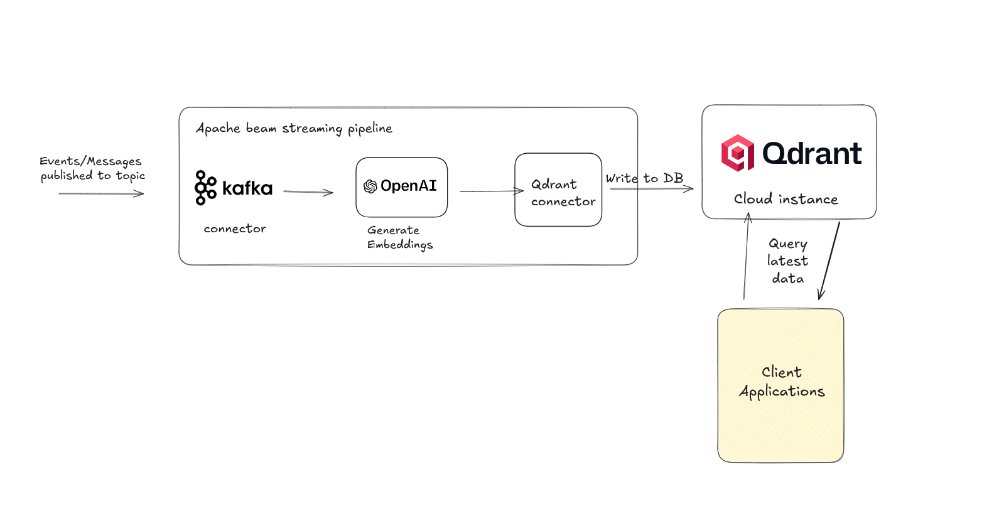

# Realtime ingestion pipeline for Qdrant

Kafka to qdrant is a apach beam streaming pipeline that consumes realtime text data from a kafka topic, generate vector embeddings for the data using openai models and write the embeddings to qdrant db.
This pipeline will help applications like AI agents and RAG, query latest and fresh data from their qdrant instance.

## Usecases

- Real-time semantic search indexing
- Live recommendation systems
- Real-time knowledge base updates
- Event-driven vector database population


## Architecture



This pipeline continuously consumes messages from a Kafka topic using Apache Beam’s KafkaIO connector.
Incoming messages are grouped into fixed 10-second windows for batch processing and limit the frequency of calls to external services like OpenAI and Qdrant, helping to prevent overload. Each message’s content is sent to an OpenAI embedding model via LangchainBeam, which generates vector embeddings. These embeddings are then upserted into a qdrant vector database with the specified collection name as points.


## How to run the pipeline.

The pipeline can be run on apache flink using beam's flink runner, by following these 2 steps.

### Step 1: Setup flink locally

download flink 1.19

```sh
wget https://dlcdn.apache.org/flink/flink-1.19.3/flink-1.19.3-bin-scala_2.12.tgz
```

extract files
```sh
tar -xzf flink-1.19.3-bin-scala_2.12.tgz
```

start the flink cluster

```sh
cd flink-1.19.3-bin-scala_2.12

# start cluster using script
./bin/start-cluster.sh
```
once you start the flink cluster, verify that the Flink Web UI is running at [http://localhost:8081/](http://localhost:8081)

### Step 2: Submit job 

now that we have flink cluster running locally we can submit the template as a job to the cluster for execution.

Before submitting the job build the pipeline.

```
mvn clean package
```

Submit job using CLI

```
# Make sure you are in directory where cli is present
cd flink-1.19.3-bin-scala_2.12

# submit job

```sh
./bin/flink run \
  -c com.example.qdranthackathon.KafkaToQdrant \
  /home/ganesh/qdranthack/kafka-to-qdrant/target/kafka-to-qdrant-1.0.jar \ #replace your local jar path
  --runner=FlinkRunner \
  --brokers=broker_1:9092 \
  --topic=topic_0 \
  --embeddingModel=text-embedding-ada-002 \
  --kafkaUsername=id \
  --kafkaPassword=secret \
  --kafkaSecurityProtocol=SASL_SSL \
  --kafkaSaslMechanism=PLAIN \
  --openaiApiKey=openai-key \
  --qdrantHost=remote-host \
  --collectionName=collection \
  --qdrantApiKey=api-key
```
This command will submit the pipeline as a job to the cluster and start the pipeline with the below pipeline options

- `broker` - kafka brokers
- `topic`  - topic name to read messages from
- `kafkaUsername` - id for authenticating the brokers
- `kafkaPassword` - secret for authenticating the brokers
- `kafkaSecurityProtocol` - kafka auth type
- `kafkaSaslMechanism` - kafka auth Mechanism
- `embeddingModel` - model to use to generate vector embeddings
- `openaiApiKey` - openai api key
- `qdrantHost` - Qdrant cloud instance URL,
- `collectionName` - collection name to write embeddings to
- `qdrantApiKey` - Qdrant api key for authentication.


## Demo Video


watch it directly on [Loom](https://www.loom.com/share/708b9a903ee3434799d86688e080fc37?sid=0e6b4d98-9133-4881-87a2-8c47a6e20294)